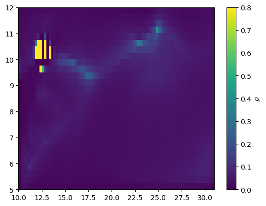
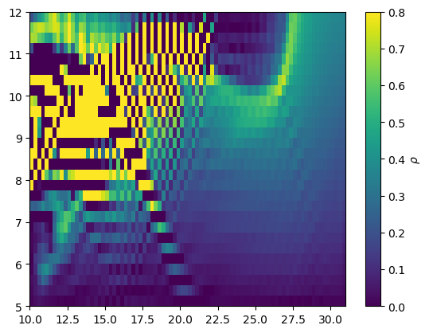
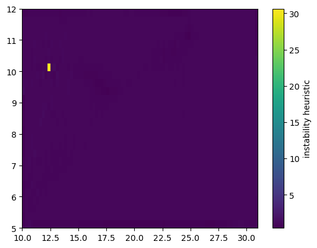
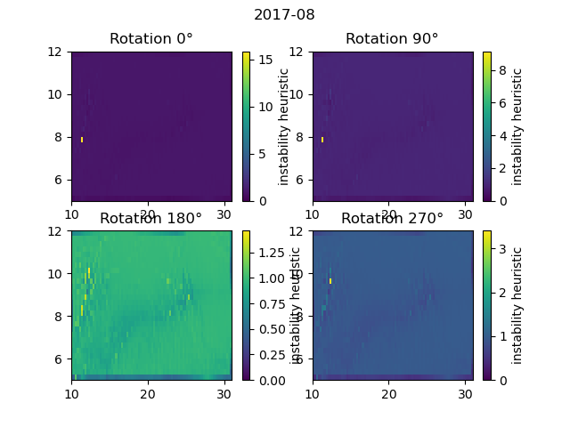
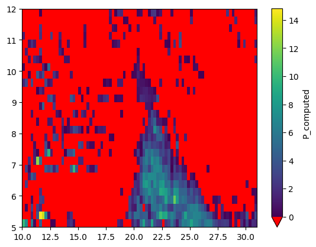

# Numerical stability

We have observed that in some cases this model does not converge to a well-behaved solution.
But instead diverges (runs away) to very large values of $\rho$.

e.g. 1 - 1992 August



e.g. 2 - 1994 July




The above examples are the scalar field of $\rho$,
plotted after the model has detected divergence and exited.

To understand why this happens, we need to look at the coefficients of the model equations.

$$
\rho^{k+1} = \frac{A_1}{A_0}
$$

where $A_0$ is defined by the four cases of flux direction (SW, NW, NE, SE) as per [[2]](#ref-2) equation (A.4).

and $A_0$ is decomposed into terms:

$$
A_1 = \alpha_1 
    + \alpha_C \rho^k_C 
    + \alpha_U \rho^k_U 
    + \alpha_R \rho^k_R
    + \alpha_D \rho^{k+1}_D
    + \alpha_L \rho^{k+1}_L
$$

If $| A_1 / A_0 | \gg 1$ then the iterative scheme will diverge outside of the physical bounds of $\rho \in [0, 1]$.

## Term $A_0$

$A_0$ is defined by the four cases of flux direction (SW, NW, NE, SE) as per [[2]](#ref-2) equation (A.4).

Looking at SW case (the other cases are similar):

$$
A_0 = 2 P \Delta x \Delta y + F^{(x)}_R \Delta y + F^{(y)}_U \Delta x
$$

where 

- $P$ is the precipitation
- $F^{(x)}_R$ is the x-flux of atmospheric water vapour on the **right** edge of the grid cell
- $F^{(y)}_U$ is the y-flux of atmospheric water vapour on the **upper** edge of the grid cell

I think it is clear from all four cases that $A_0$ should be positive, assuming a physically meaningful precipitation $P$,
and additive flux terms matching predominant flux directions.

### Negative $P$

$P$ is a derived quantity in this model.
See [[2]](#ref-2), §2a.

> Since the derivation of Eq. (2.2) implies the validity
of (2.1), the biases in the data inevitably result in
errors in the recycling ratio values.
> The procedure for
determining the recycling ratio will be more consistent if one introduces adjustments into the data to make Eq.
(2.1) valid.
> [...]
> we determine the precipitation flux P at the grid
points from the data using (2.1) and then solve Eq. (2.2)
with the calculated P values. 
> The level of the biases in
the data can be estimated by comparing the flux P calculated
as the analysis residuals with the precipitation
data Pd.

We have observed that in some cases the calculated $P$ is negative.
See also [[2]](#ref-2), §2d and Fig. 7.

Clearly, a negative precipitation is unphysical, and should be a concern.
However, it is not _necessarily_ fatal to the model stability.

The problematic regime is when $P$ is negative enough to push $A_0$ close to zero.

### Divergent fluxes

The other possibility is that the flux terms,
which are assumed to be positive terms in $A_0$,
are in fact negative.

This case arises because flux direction for a cell (SW, NW, NE, SE) is determined by the sign of $F^{(x)}_L$ and $F^{(y)}_D$, where

- $F^{(x)}_L$ is the x-flux of atmospheric water vapour on the **left** edge of the grid cell
- $F^{(y)}_D$ is the y-flux of atmospheric water vapour on the **bottom** edge of the grid cell

whilst the flux terms in $A_0$ may include contributions from the **right** and **upper** edges of the grid cell.
These terms may be in opposition.

## Term $A_1$

### Term $\alpha_1$

The term $\alpha_1$ is a constant, independent of fluxes

$$
\alpha_1 = 2 E \Delta x \Delta y
$$

In the limit of no fluxes $F$, $P = E$, and so

$$
\rho^{k+1} 
= \frac{\alpha_1}{A_0} 
= \frac{2 E \Delta x \Delta y}{2 P \Delta x \Delta y} 
= 1
$$

Note that if starting from an initial guess of $\rho^0=0$,
with relaxation parameter $R$,
the first iteration is

$$
\rho^1 \sim R \frac{\alpha_1}{A_0}
$$

### Term $\alpha_C$

This term is the coefficient of self-coupling, proportional to $\rho^k$.

We have numerical instability if $| \alpha_C / A_0 | \gg 1$.

A similar analysis can be done for the other coupling terms $\alpha_U$, $\alpha_R$, $\alpha_D$, and $\alpha_L$.

## Instability condition

We propose a heuristic for numerical instability:

$$
\max ( | \alpha_X / A_0 | ) \gg 1
$$

for $X \in \{1, C, U, R, D, L\}$.

This is implemented as `Coefficients.instability_heuristic`.

The examples below correspond to the same cases as above.

e.g. 1 - 1992 August



e.g. 2 - 1994 July


### Observations

Well behaved cases tend to have instability heuristic values $\lesssim 1.2$.

Model runs that diverge tend to have instability heuristic values $\gtrsim 1.6$.
This is usually just one or two unlucky grid cells.
In ~75% of these cases, the identified grid cell corresponds with a negative precipitation $P$.

The model coefficients, and hence this criteria,
are different on a rotated grid.
In the example below, the grid is rotated to all four possible orientations.
We plot the instability heuristic for each orientation, rotated back to the original orientation for comparison.
Rotating the grid by 180° permits a well-behaved solution.



## Mitigation strategies

The following strategies may be employed (in order) to mitigate numerical instability.

### 1. Input evaporation $E$

The first port of call is to check the input evaporation $E$ field.
Specifically the input to `preprocess.calculate_precipitation`.
This should be physically reasonable given the temporal aggregation period.

Negative and very small values of $E$ should be regarded as potentially problematic.

### 2. Calculated precipitation $P$

Negative values of $P$ are not necessarily fatal to the numerical stability of the model.
However, they are unphysical.

⚠️ It is not clear that any solution is meaningful given non-negligible negative $P$. ⚠️

See [[2]](#ref-2), §2d and Fig. 7, where the authors discuss their concerns and analysis of negative precipitation (referred to as model bias).

An extreme example is shown below from 1990 February.
75% of grid cells have negative $P$,
with average $P$ of -1.63 mm/day across the domain.
The model does not converge in this case.



The cause of negative $P$ is clear from the conservation of water vapour [[2]](#ref-2), equations (2.1) and (A.1).

$$
P = E - \nabla \cdot \vec{F}
$$

Divergence in flux drives negative $P$ when not balanced by sufficient evaporation $E$.
This may occur over steep orography, and/or in the presence of strong wind shear, 
where the vertical integration (over pressure levels from surface pressure) is not well resolved.

### 3. Check the instability heuristic

```python
P = preprocess.calculate_precipitation(...)
coeffs = coefficients.Coefficients(..., E, P, ...)
instability_heuristic = coeffs.instability_heuristic
```

This is a numpy array on the secondary grid.
Higher values (hot spots) identify the location problematic input data,
which is usually the origin of numerical instability.

### 4. Preprocessing

The usual data preprocessing pipeline is

- input data in (x, y, z, t)
- create temporal aggregates of wind and humidity (x, y, z)
- compute the integrated fluxes on the primary grid (x, y)
- apply scaling
- interpolate all variables onto the secondary grid

We suggest considering alternative strategies

#### 4a. Delay temporal aggregation

Compute the integrated fluxes on a per-timestep basis (x, y, t),
then apply temporal aggregation (x, y).
This should capture co-variability of wind and humidity at height more accurately.

#### 4b. Delay vertical integration

Interpolate vertical / pressure level data (x, y, z) onto the secondary grid
before computing the integrated fluxes.
This should capture orographic effects and wind shear more accurately.

#### 4c. Course resolution

Instead of defining the secondary grid as a "half-step" offset from the primary grid,
define the secondary grid directly on top of the primary grid at half the resolution.

See `bulk_recycling_model/preprocess_low_resolution.py` for utility functions to support this,
and `notebooks/run_dao_data_low_res.ipynb` for an example workflow.

### 5. Rotate the grid

Rotating the grid by 90°, 180°, or 270°
may change the coefficients sufficiently to permit a well-behaved solution.

You can inspect the instability heuristic in each orientation,
rotated back to the original orientation for comparison.

```python
P = preprocess.calculate_precipitation(...)
coeffs = coefficients.Coefficients(..., E, P, ...)
# k = 0, 1, 2, 3 for 0°, 90°, 180°, 270°
instability_heuristic = coeffs.rotated_instability_heuristic(k=1)
```

and run the model on the rotated grid

```python
status = main.run_rotated(..., rotation=k)
```

### 6. Nudge problematic grid cells

Usually only one or two grid cells are the source of numerical instability.
These appear as "hot pixels" in the instability heuristic field.

You can locate hot pixel(s)

```python
i, j = numerical_stability.identify_hot_pixel(
    coeffs.instability_heuristic
)
```

As a last resort, apply a nudge to the evaporation $E$.

The aim here is to move the coefficients $A_0$ and $A_1$ away from the regime where $| A_1 / A_0 | \gg 1$,
whilst conserving local evaporation.

```python
nudge = ...
E = numerical_stability.nudge_hot_pixel(
    E, i, j, offset=nudge
)
P = preprocess.calculate_precipitation(..., E, ...)
```

This is not a physically rigorous approach.
But may be acceptable if the nudge is local and evaporation is conserved.

## Other Interventions

The following interventions have been considered but not found to be effective.
Your mileage may vary.

### Clip $P$

Clipping negative values of $P$ to zero.
Note that this violates conservation of water vapour.

### Clamp $\rho$

Applying a clamp to $\rho$ after each iteration to enforce physical bounds $[0, 1]$.

## References

<a id="ref-1"></a>1. Burde, G. I., 2006: Bulk Recycling Models with Incomplete Vertical Mixing.
Part I: Conceptual Framework and Models. 
J. Climate, 19, 1461–1472, https://doi.org/10.1175/JCLI3687.1. 

<a id="ref-2"></a>2. Burde, G. I., C. Gandush, and Y. Bayarjargal, 2006: Bulk Recycling Models with Incomplete Vertical Mixing.
Part II: Precipitation Recycling in the Amazon Basin.
J. Climate, 19, 1473–1489, https://doi.org/10.1175/JCLI3688.1. 
